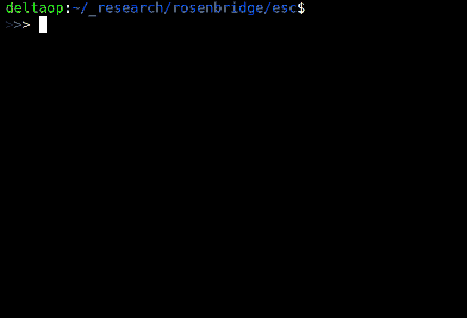

## project:rosenbridge
: hardware backdoors in x86 CPUs

github.com/xoreaxeaxeax/rosenbridge // domas // @xoreaxeaxeax



### Overview

project:rosenbridge reveals a hardware backdoor in some desktop, laptop, and
embedded x86 processors.

The backdoor allows ring 3 (userland) code to circumvent processor protections
to freely read and write ring 0 (kernel) data.  While the backdoor is typically
disabled (requiring ring 0 execution to enable it), we have found that it is
*enabled by default* on some systems.

This repository contains utilities to check if your processor is affected, close
the backdoor if it is present, and the research and tools used to discover and
analyze the backdoor.

### The Backdoor

The rosenbridge backdoor is a small, non-x86 core embedded alongside the main
x86 core in the CPU.  It is enabled by a model-specific-register control bit,
and then toggled with a _launch-instruction_.  The embedded core is then fed
commands, wrapped in a specially formatted x86 instruction.  The core executes
these commands (which we call the 'deeply embedded instruction set'), bypassing
all memory protections and privilege checks.

While the backdoor should require kernel level access to activate, it has been
observed to be *enabled by default* on some systems, allowing any unprivileged
code to modify the kernel.

The rosenbridge backdoor is entirely distinct from other publicly known
coprocessors on x86 CPUs, such as the Management Engine or Platform Security
Processor; it is more deeply embedded than any known coprocessor, having access
to not only all of the CPU's memory, but its register file and execution
pipeline as well.

### Affected Systems

It is thought that only VIA C3 CPUs are affected by this issue.  The C-series
processors are marketed towards industrial automation, point-of-sale, ATM, and
healthcare hardware, as well as a variety of consumer desktop and laptop
computers.

### Looking Forward

The scope of this vulnerability is limited; generations of CPUs after the C3 no
longer contain this feature.

This work is released as a case study and thought experiment, illustrating how
backdoors might arise in increasingly complex processors, and how researchers
and end-users might identify such features.  The tools and research offered
here provide the starting point for ever-deeper processor vulnerability
research.

### Checking your CPU

To check if your CPU is affected:

```
git clone https://github.com/xoreaxeaxeax/rosenbridge
cd rosenbridge/util
make
sudo modprobe msr
sudo ./bin/check
```

The provided utility must be run on baremetal (not in a virtual-machine), and is
in an *alpha* state.  It may crash, panic, or hang systems not containing the
backdoor.

The utilities provided here are designed around a specific processor family and
core; unfortunately, the tools will miss the backdoor if it has been even
slightly modified from the researched form.

### Closing the Backdoor

Some systems have the backdoor enabled by default, allowing unprivileged code to
gain kernel level access without permission.  If the steps in 'Checking your
CPU' indicate that your CPU is vulnerable, you can install a script to close the
backdoor early in the boot process:

```
cd fix
make
sudo make install
reboot
```

Note that, even with this, an attacker with kernel level access can still
re-enable the backdoor.  This script is provided as an outline for correcting
the issue during the boot process, but will require adaptation for different
systems.

### Tools and Techniques

The [sandsifter](https://github.com/xoreaxeaxeax/sandsifter) utility is used
extensively in this research for uncovering unknown instructions.

* asm

	An assembler for the Deeply Embedded Instruction Set (DEIS).  It converts
	programs written in the custom rosenbridge assembly into x86 instructions,
	which, when executed following the _launch-instruction_, will send the
	commands to the hidden CPU core.

* esc

	A proof-of-concept of using the rosenbridge backdoor for privilege
	escalation.

* fix

	A rough outline for closing the vulnerability on affected systems, to the
	extent possible through model-specific-register updates.

* fuzz

	A collection of utilities used to fuzz both the x86 and rosenbridge cores,
	in order to isolate the unknown _launch-instruction_ and
	_bridge-instruction_, and resolve the instruction format of the rosenbridge
	core.

	* deis

		The fuzzer used to explore the effects and capabilities of the
		hidden CPU core.

	* exit

		It is thought that, on some processors, an exit sequence is needed to
		switch back to the x86 core at the end of a DEIS sequence.  This
		directory contains the utilities used to search for the exit sequence in
		early stages of the research, but was abandoned when a processor was
		found not requiring any such sequence.

	* manager

		A collection of python utilities designed to monitor and manage fuzzing
		tasks distributed across a network of workers.

	* wrap

		A stripped down version of the sandsifter fuzzer, used to identify the
		bridge-instruction that will send commands from the x86 core to the
		hidden rosenbridge core.
		
* kern

	A collection of helper utilities used to monitor kernel memory and registers
	for changes caused by fuzzed DEIS instructions.

* lock

	Utilities to lock or unlock the rosenbridge backdoor.

* proc

	A tool to identify patterns from the fuzzing logs to identify classes of
	DEIS instruction behaviors.

* test

	A tool used early in the research, to attempt to identify the hidden core's
	architecture by executing known RISC instructions.

* util

	An alpha-state tool to detect whether or not a processor is affected by
	rosenbridge.

### References

(TODO: link to whitepaper)

(TODO: link to slides)

### Disclaimer

The details and implications presented in this work are the authors’ inferences
and opinions, derived from the research described.  The research is performed
and provided with the goal of identifying and fixing a perceived security
vulnerability on the described CPUs.  VIA processors are renowned for
their low power usage and excellence in embedded designs; we believe that the
functionality described was created in good faith as a useful feature for the
embedded market, and was unintentionally left enabled on some early generations
of the processor.  No malicious intent is implied.

### Author

project:rosenbridge is a research effort from Christopher Domas
([@xoreaxeaxeax](https://twitter.com/xoreaxeaxeax)).
